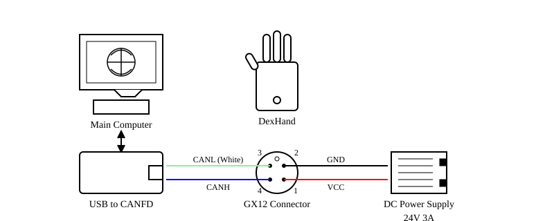

Quickstart Guide
==============

This guide will help you get started with the DexHand Python Interface.

Overview
--------

The DexHand Python Interface provides:

* CANFD communication interface for DexHand hardware
* Joint-space control interface with feedback processing
* Built-in data logging and visualization tools
* ROS2 interface implementation
* Hardware testing utilities

Prerequisites
------------

* Linux environment
* Python 3.8+
* ZLG USBCANFD adapter (tested with USBCANFD-200U)
* ROS1/ROS2 (optional, for ROS interface)

Hardware Setup
-------------

Please refer to the hardware connection diagram:

Installation
-----------

1. Install the package::

    pip install -e .

2. Configure USB permissions::

    sudo ./tools/setup_usb_can.sh

The setup script will:

* Create a canbus group
* Add your user to the group
* Set up udev rules for the USBCANFD adapter
* Configure appropriate permissions

You may need to log out and back in for the changes to take effect.

3. Edit ``config/config.yaml`` to match your hardware setup, especially channels and ZCAN device type.

Usage Examples
------------

1. Hardware Testing
^^^^^^^^^^^^^^^^^

Run hardware tests to verify your setup::

    python tools/hardware_test/test_dexhand.py --hands right

This should move the hand through a series of predefined motions.

2. Interactive Control
^^^^^^^^^^^^^^^^^^

CLI Option
"""""""""

Launch interactive control interface::

    python tools/hardware_test/test_dexhand_interactive.py --hands right

This provides an IPython shell with initialized hand objects and helper functions.

Example commands::

    right_hand.move_joints(th_rot=30)  # Rotate thumb
    right_hand.move_joints(ff_mcp=60, ff_dip=60)  # Curl index finger
    right_hand.move_joints(ff_spr=20, control_mode=ControlMode.PROTECT_HALL_POSITION)  # Spread all fingers, with alternative control mode
    
    # Advanced control with current and velocity specified
    from pyzlg_dexhand import JointCommand
    right_hand.move_joints(
        th_rot=JointCommand(position=30, current=25, velocity=12000),  # Full control
        ff_mcp=JointCommand(position=60, current=30)  # Position and current
    )
    
    right_hand.get_feedback()
    right_hand.reset_joints()
    right_hand.clear_errors()    # Clear all error states

You can explore the API with tab completion and help commands.

GUI Option
"""""""""

Firstly, install the ``PyQt6`` dependency::

    pip install PyQt6    # Install other dependencies, via e.g., apt, if prompted

Then, run the GUI interface::

    python examples/dexhand_gui.py

The GUI provides real-time joint angle control via sliders.

3. ROS Integration
^^^^^^^^^^^^^^^

The SDK provides a ROS interface supporting both ROS1 (rospy) and ROS2 (rclpy) environments.

Start the ROS node::

    # Launch node with default configuration
    python examples/ros_node/dexhand_ros.py

    # Run the demo publisher
    python examples/ros_node/dexhand_ros_publisher_demo.py --hands right --cycle-time 3.0
    
    # Run continuous joint motion publisher
    python examples/ros_node/continuous_joint_publisher.py --pattern sine --amplitude 30 --period 5

Interface
""""""""

**Topics:**

+---------------------------+---------------------------+----------+--------------------------------+
| Topic (default)           | Type                      | Direction| Description                    |
+===========================+===========================+==========+================================+
| /left_hand_joint_commands | sensor_msgs/JointState    | Input    | Left hand joint commands       |
+---------------------------+---------------------------+----------+--------------------------------+
| /right_hand_joint_commands| sensor_msgs/JointState    | Input    | Right hand joint commands      |
+---------------------------+---------------------------+----------+--------------------------------+
| /left_hand_joint_states   | sensor_msgs/JointState    | Output   | Left hand joint feedback       |
+---------------------------+---------------------------+----------+--------------------------------+
| /right_hand_joint_states  | sensor_msgs/JointState    | Output   | Right hand joint feedback      |
+---------------------------+---------------------------+----------+--------------------------------+
| /left_touch_sensors       | Float64MultiArray         | Output   | Left hand touch sensor data    |
+---------------------------+---------------------------+----------+--------------------------------+
| /right_touch_sensors      | Float64MultiArray         | Output   | Right hand touch sensor data   |
+---------------------------+---------------------------+----------+--------------------------------+
| /left_motor_feedback      | Float64MultiArray         | Output   | Left hand detailed motor data  |
+---------------------------+---------------------------+----------+--------------------------------+
| /right_motor_feedback     | Float64MultiArray         | Output   | Right hand detailed motor data |
+---------------------------+---------------------------+----------+--------------------------------+

**Services:**

+-------------+------------------+--------------------------------+
| Service     | Type             | Description                    |
+=============+==================+================================+
| /reset_hands| std_srvs/Trigger | Reset hands to default position|
+-------------+------------------+--------------------------------+

Notes:

* Joint names in commands match the URDF file specifications
* Configuration can be customized through ``config/config.yaml``
* All features work identically in both ROS1 and ROS2 environments

Message Format Details
"""""""""""""""""""""

**Input (JointState):**

- Standard ``sensor_msgs/JointState`` message
- ``position`` field contains desired joint angles in degrees
- Joint names should match URDF joint names

**Output (Touch Sensor - Float64MultiArray):**

- Array format: ``[t, f_n, f_n_δ, f_t, f_t_δ, dir, prox, temp, ...]``
- Data for 5 fingers with 8 values per finger (40 total values)
- Values per finger:
  - timestamp: Time in seconds
  - normal_force: Force perpendicular to fingertip (N)
  - normal_force_delta: Change in normal force (raw units)
  - tangential_force: Force parallel to fingertip (N)
  - tangential_force_delta: Change in tangential force (raw units)
  - direction: Force direction (0-359 degrees, -1 for invalid)
  - proximity: Object proximity reading (raw units)
  - temperature: Fingertip temperature (Celsius)

**Output (Motor Feedback - Float64MultiArray):**

- Array format: ``[t, angle, encoder, current, velocity, error, impedance, ...]``
- Data for 12 motors with 7 values per motor (84 total values)
- Values per motor:
  - timestamp: Time in seconds
  - angle: Joint angle (degrees)
  - encoder_position: Raw encoder value
  - current: Motor current (mA)
  - velocity: Motor velocity (rpm)
  - error_code: Motor error code (0 = no error)
  - impedance: Motor impedance value

4. Programming Interface
^^^^^^^^^^^^^^^^^^^^

Example code:

.. code-block:: python

    from pyzlg_dexhand import LeftDexHand, RightDexHand, ControlMode, JointCommand

    # Initialize hand
    hand = RightDexHand()
    hand.init()

    # Basic position control
    hand.move_joints(
        th_rot=30,  # Thumb rotation (0-150 degrees)
        th_mcp=45,  # Thumb MCP flexion (0-90 degrees)
        th_dip=45,  # Thumb coupled distal flexion
        control_mode=ControlMode.CASCADED_PID  # Default control mode
    )
    
    # Advanced control with JointCommand for fine-tuning
    hand.move_joints(
        th_rot=JointCommand(position=30, current=25, velocity=12000),  # Full control
        th_mcp=JointCommand(position=45, current=30),  # Position and current only
        th_dip=45,  # Basic position control
        control_mode=ControlMode.IMPEDANCE_GRASP
    )

    # Get feedback
    feedback = hand.get_feedback()
    print(f"Thumb angle: {feedback.joints['th_rot'].angle}")
    print(f"Touch sensor force: {feedback.touch['th'].normal_force}")

Control Modes
^^^^^^^^^^^

* ``CASCADED_PID``: Provides precise position control with higher stiffness
* ``PROTECT_HALL_POSITION``: Offers smoother response but requires joints to be in zero position at power-on
* ``MIT_TORQUE``: High-precision torque control mode that maintains stable force after object contact. Allows for dynamic force adjustments while maintaining position tracking. Ideal for delicate interaction tasks.
* ``IMPEDANCE_GRASP``: Optimized for safe grasping operations. Automatically detects contact with objects and reduces force to prevent damage. Recommended for adaptive grasping of delicate objects with varying stiffness.

Error Handling
^^^^^^^^^^^^

When a finger's motion is obstructed by an object, it may enter an error state and become unresponsive to control signals. For reliable continuous control, call ``hand.clear_errors()`` after sending each command.

Data Logging
----------

Built-in logging for analysis and debugging:

.. code-block:: python

    from pyzlg_dexhand import DexHandLogger

    # Initialize logger
    logger = DexHandLogger()

    # Log commands and feedback
    logger.log_command(command_type, joint_commands, control_mode, hand)
    logger.log_feedback(feedback_data, hand)

    # Generate analysis
    logger.plot_session(show=True, save=True)

Logs include:

* Joint commands and feedback
* Tactile sensor data
* Error states
* Timing information

Next Steps
---------

* Review the API documentation for detailed interface information
* Check out the examples directory for more usage examples
* See the hardware test scripts for automated testing approaches
